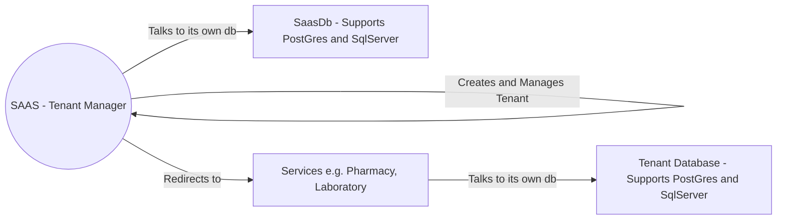

# Saas

The application that caters multiple tenants and lets tenants use different applications accordingly.

# Architecture

The solution is based on onion architecture with each application has 
1. Core Project
2. Infrastructure Project
3. Web API Project

Each application maintains its migration in a different projects to support two database providers. The projects are
1. Infrastructure.PostGresMigration
2. Infrastructure.SqlServerMigration

# Application EcoSystem



# Setting up development environment

Add connection strings and db provider to Saas.Web Project

```
  "DbProvider": "SqlServer", // PostGreSql, SqlServer
  "ConnectionStrings": {
    "Default": "Server=DESKTOP-SMKA2JD;Database=saasDb;Trusted_Connection=true;"
    OR
    "Default":"Server=127.0.0.1;Port=5432;Database=saasDb;User Id=<your-user>;Password=<your-password>;"
  }
```

# Managing Migrations
## Prequisitie
You must have dotnet ef tools globally installed.

```
dotnet tool install --global dotnet-ef
```

## For Saas Project

Open Terminal in the directory "SAAS"

### For Sql Server
Update your connection string to use Sql Server.
See [# Setting up development environment](#Setting%20up%20development%20environment) to configure connection string.
```
dotnet ef migrations add "<migration-name>" -s "SAAS.Web" -p "SAAS.Infrastructure.SqlServer" -- --dbProvider SqlServer
```
### For Post Gre Sql
Update your connection string to use Post Gre Sql.
See [# Setting up development environment](#Setting%20up%20development%20environment) to configure connection string.
```
dotnet ef migrations add "<migration-name>" -s "SAAS.Web" -p "SAAS.Infrastructure.PostGreSql" -- --dbProvider PostGreSql
```


## For other projects

Both Laboratory and Pharmacy have similar migration process.
Lets take an example for Laboratory


Open Terminal in the directory "Laboratory"


### For Sql Server
```
dotnet ef migrations add "<migration-name>" -s "Laboratory.Web" -p "Laboratory.Infrastructure.SqlServerMigration" -- "SqlServer" "<sql-connection-string>"
```

### For Post Gre Sql
```
dotnet ef migrations add "<migration-name>" -s "Laboratory.Web" -p "Laboratory.Infrastructure.PostGresMigration" -- "PostGreSql" "<postgre-connection-string>"
```


# Running the application

Set up multiple startup project for the solution.

Starting SAAS project in mandatory.
Start other projects as per your wish.

All project will start with a swagger UI.

While accessing the tenant specific APIs in Pharmacy and Laboratory Project,
we need to add header to the request with key as '**tenant**' and value as **TenantId** provided.

You can use the openapi document created by swagger directly in postman to browse the apis.


# Thank you!


